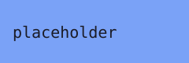

This placeholder post exercises the RSS feed, recent activity, an image kept in an ignored `_assets` folder, and an absolute internal link.



Continue with the [placeholder topic](/notes/placeholder-topic) or read the [placeholder study](/research/placeholder-study).

## First section

Inline math such as $e^{i\pi} + 1 = 0$ and a footnote.[^1]

## Second section

```ts
const greeting: string = 'placeholder';
```

[^1]: A placeholder footnote.
